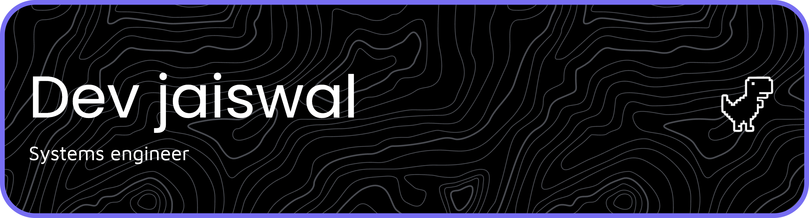

<!-- markdownlint-disable MD033 -->

  

 

 

## 🚀 About

I design software with emphasis on clarity, modular structure, and long-term maintainability.

My work focuses on how systems behave internally — state flow, transaction validation, component boundaries, and complexity control.

**Currently:**
- Developing a custom Electron-based productivity engine with a structured layout and rendering pipeline.
- Strengthening algorithmic reasoning and codebase navigation skills.
- Studying distributed and protocol-oriented systems.
- Preparing for deeper open-source contributions.

I value precision, consistency, and engineering depth over surface complexity.

 

 

## 🛠 Technical Stack

| I have | I'm learning |
| :---: | :---: |
|  |  |

  

 

## 📊 Activity

  

 

 

## 🌱 Engineering Direction

Working toward contributing to large open-source systems and developing protocol-level understanding through structured, implementation-focused projects.

Pinned repositories reflect projects that emphasize architecture, reasoning, and problem-solving depth.

 

 

## 🔗 Connect

- LinkedIn: https://linkedin.com/in/dev-jaiswal--  
- Instagram: https://instagram.com/devxdxd
