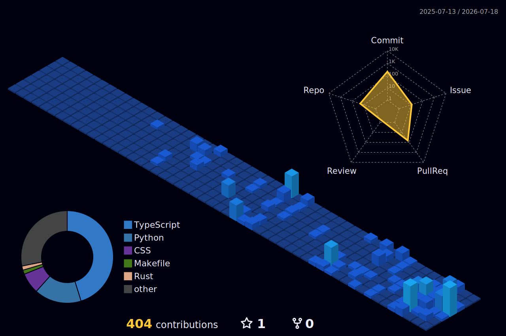

<!-- markdownlint-disable MD033 -->

<table width="100%">
  <tr>
    <td width="30%" align="center">
      
    </td>
    <td width="25%" align="center">
      <h3>Connect :)</h3>
      
      &nbsp;
      
    </td>
    <td width="45%" align="center">
      
    </td>
  </tr>
</table>

## About

Focused on building robust infrastructure, networking tools, and distributed systems. Instead of standard web applications, I prefer to tackle specialized, low-level challenges. Using languages like Rust, Go, and TypeScript, I build tools ranging from Bitcoin SPV engines and low-latency KVMs to automated identity verification pipelines.

I naturally gravitate toward projects that sit close to the metal. To me, the most interesting problems are the ones where performance, memory safety, and strict state management are the primary constraints.

 

 

## Technical Stack

| I have | I'm learning |
| :---: | :---: |
|  |  |

  

 

## Projects

<table align="center" width="100%">
  <tr>
    <td width="50%" valign="top">
      <h3>
        <a href="https://github.com/cynox-66/Meridian">Meridian</a>
      </h3>
      
A spatial planning application merging task execution with reflective memory. Built to reduce cognitive load over long-term usage.

      

        
        
      

    </td>
    <td width="50%" valign="top">
      <h3>
        <a href="https://github.com/cynox-66/mini-spv-node">mini-spv-node</a>
      </h3>
      
A Bitcoin SPV implementation verifying block headers and PoW without storing full chain data. Handles fork resolution and cumulative work tracking.

      

        
        
      

    </td>
  </tr>
  <tr>
    <td width="50%" valign="top">
      <h3>
        <a href="https://github.com/cynox-66/knowledge-extractor">knowledge-extractor</a>
      </h3>
      
A browser knowledge extraction pipeline structuring unstructured data via LLMs. Automates insight generation at scale.

      

        
      

    </td>
    <td width="50%" valign="top">
      <h3>
        <a href="https://github.com/cynox-66/pr-identity-verifier">pr-identity-verifier</a>
      </h3>
      
An automated identity verification system enforcing compliance across distributed teams. Secures pull requests against unauthorized authorship.

      

        
        
      

    </td>
  </tr>
</table>

 

 

## Activity

<table width="100%">
  <tr>
    <td align="center">
      
    </td>
  </tr>

</table>

 

 

## Engineering Direction

- **Open Source:** Actively contributing to Cloud Native Computing Foundation (CNCF) and Linux Foundation security projects.
- **Security & Infrastructure:** Exploring runtime security, eBPF, and Kubernetes workload hardening.
- **Language Focus:** Writing Rust for memory-safe systems programming and Go for cloud-native tooling.
- **Goal:** Building resilient, long-term distributed systems.

 

 
